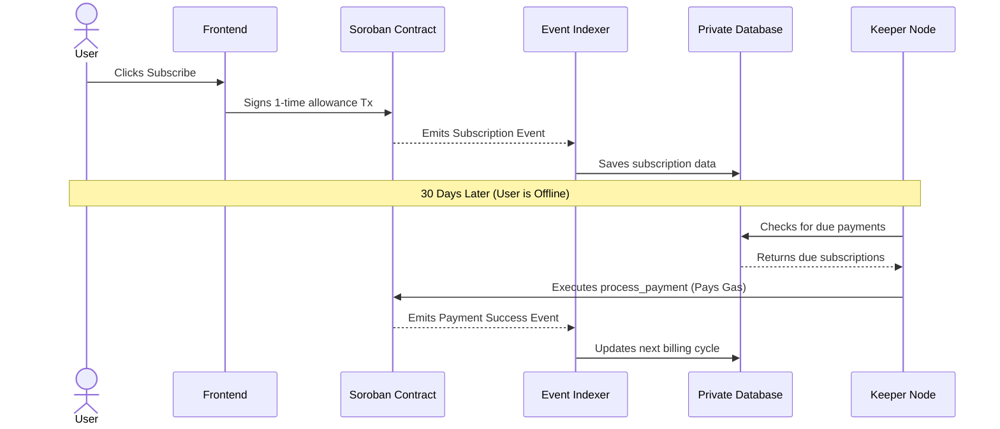

# Recurra - Web3 Recurring Payments Platform

- **Live Demo:** [https://recurra-omega.vercel.app/](https://recurra-omega.vercel.app/)
- **Video Demo:** [https://drive.google.com/file/d/1XNMMoBTVS-vk5VoeOrIOehHYsTeokmZj/view?usp=sharing](https://drive.google.com/file/d/1KZiUOJZcZThXss8LVR6vYbEsdJ5dKjXN/view?usp=sharing)
- **Live User Registration & Feedback:** [View Registered Users Excel Sheet](https://docs.google.com/spreadsheets/d/1wz0QF5SknOHDpPI3d4NrILENi_0Ev-dNxH25IEin4ok/edit?usp=sharing)
- **Verified Mainnet Transaction:** [85dde33ce4b6a7e78be8595bf23a5bd5deb2fe76df2a2b66484194f501588b0e](https://stellar.expert/explorer/public/tx/85dde33ce4b6a7e78be8595bf23a5bd5deb2fe76df2a2b66484194f501588b0e)

Recurra is a decentralized B2B and B2C platform built on the Stellar Soroban smart contract network. It brings automated, recurring subscriptions to Web3, empowering merchants to create customizable subscription plans and allowing consumers to subscribe seamlessly directly from their self-custody wallets.

---

## The Problem

In the Web2 ecosystem, recurring payments are standard: a user enters credit card details once, and the merchant automatically pulls funds periodically.

In Web3, this is traditionally impossible. Smart contracts cannot self-execute, and cryptographic wallets require the user to explicitly sign a transaction every single time funds move. This forces Web3 subscribers to manually log in and sign a transaction every 30 days, resulting in massive churn and a degraded user experience.

## The Solution

Recurra solves this limitation through a hybrid architecture combining on-chain allowances with an off-chain automated infrastructure. 

1. **One-Time Approval:** The user approves a one-time allowance to the Recurra smart contract.
2. **Keeper Node Automation:** An off-chain background worker (the "Keeper Node") wakes up periodically to execute the `process_payment` function on the smart contract on behalf of the merchant. 
3. **Offline Reliability:** Because the Keeper automates the transaction, the user does not need to be online or connected to the internet for subsequent billing cycles. The process handles gas fees and routing entirely in the background, making it as seamless as a traditional credit card subscription.

### System Architecture Flow



---

## Technical Security & Testing

Recurra is designed with financial security and enterprise scale as priorities.

*   **Smart Contract Safety:** Built in Rust following the strict Checks-Effects-Interactions (CEI) pattern to prevent re-entrancy attacks.
*   **Idempotency & Concurrency:** The backend Keeper utilizes a distributed Redis-backed queue (BullMQ) and distributed locks. This ensures that even if multiple server instances attempt to process payments simultaneously, no user is ever double-charged.

### Testing Suite
The repository includes a comprehensive testing suite for both the backend infrastructure and the smart contracts to validate system integrity.

```bash
# Run backend tests (Jest)
cd backend
npm run test

# Run smart contract tests (Rust)
cd contracts/payment-engine
cargo test
```

---

## Installation & Setup

### Prerequisites
*   Node.js (v18+)
*   PostgreSQL
*   Rust & Soroban CLI

### 1. Backend
```bash
cd backend
npm install
cp .env.example .env
npm run dev
```

### 2. Frontend
```bash
cd frontend
npm install
cp .env.example .env
npm run dev
```

---
*License: MIT*
