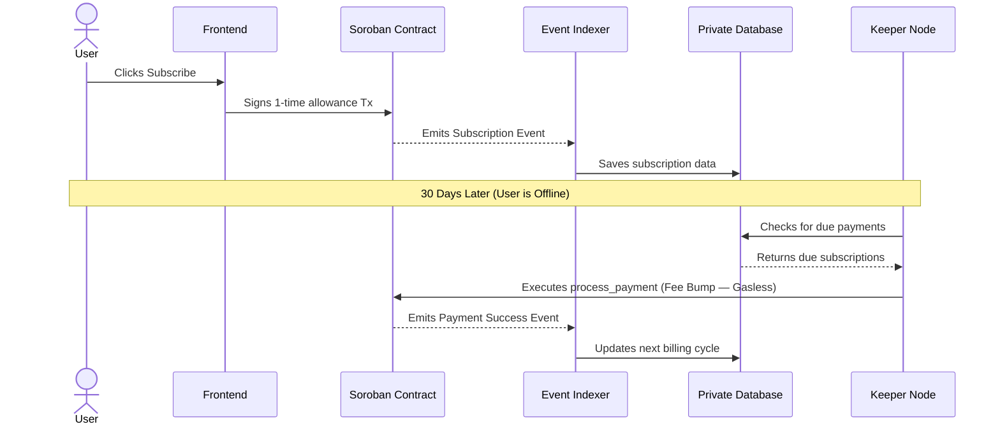

# Recurra — Web3 Recurring Payments Platform

[](https://github.com/Aditya-linux/Recurra/actions/workflows/ci.yml)

- **Live App (Mainnet):** [https://recurra-omega.vercel.app/](https://recurra-omega.vercel.app/)
- **Video Demo:** [Watch on Google Drive](https://drive.google.com/file/d/1XNMMoBTVS-vk5VoeOrIOehHYsTeokmZj/view?usp=sharing)
- **User Registration & Feedback Form:** [Google Form](https://docs.google.com/forms/d/e/1FAIpQLSeKboVY1mS0tC243RN6CuOxAsIUX5a3Ii0qHnSAtCOxKikuaA/viewform?usp=publish-editor)
- **User Feedback Responses (Excel):** [View Registered Users Sheet](https://docs.google.com/spreadsheets/d/1YggpjnWPojeq19Zl7bqp59ZDlluxgY0z7vbQ9noc4J8/edit?usp=sharing)
- **Twitter/X Launch Post:** [View Post](https://x.com/recurra116/status/2073685904448004198?s=20)
- **Ecosystem Contribution:** [Technical Blog Post](BLOG_POST.md)

---

## The Problem

In the Web2 ecosystem, recurring payments are standard: a user enters credit card details once, and the merchant automatically pulls funds periodically.

In Web3, this is traditionally impossible. Smart contracts cannot self-execute, and cryptographic wallets require the user to explicitly sign a transaction every single time funds move. This forces Web3 subscribers to manually log in and sign a transaction every 30 days, resulting in massive churn and a degraded user experience.

## The Solution

Recurra solves this limitation through a hybrid architecture combining on-chain allowances with an off-chain automated infrastructure.

1. **One-Time Approval:** The user approves a one-time allowance to the Recurra smart contract.
2. **Keeper Node Automation:** An off-chain background worker (the "Keeper Node") wakes up periodically to execute the `process_payment` function on the smart contract on behalf of the merchant.
3. **Gasless Transactions:** The Keeper uses **Stellar Fee Bump Transactions** to sponsor all gas fees — subscribers pay $0 in network fees.
4. **Offline Reliability:** Because the Keeper automates the transaction, the user does not need to be online or connected to the internet for subsequent billing cycles.

### System Architecture



---

## ⚡ Advanced Feature: Fee Sponsorship (Gasless Transactions)

Recurra implements **Stellar Fee Bump Transactions** as its Level 6 advanced feature, making all recurring payments completely **gasless** for end-users.

### How It Works
1. The Keeper builds an inner Soroban transaction calling `execute_payment` on the Payment Engine contract
2. The inner transaction is wrapped in a **Fee Bump Transaction** where the Keeper account is the `feeSource`
3. The Keeper signs and submits the fee-bumped envelope to the Soroban RPC
4. **Result:** Subscribers pay only their subscription amount (e.g., 10 USDC) — zero XLM gas fees

### Implementation
- **Module:** [`backend/src/keeper/FeeSponsor.ts`](backend/src/keeper/FeeSponsor.ts)
- **Integration:** [`backend/src/keeper/index.ts`](backend/src/keeper/index.ts) — Worker attempts fee-sponsored execution first, falling back to the TransactionBatcher
- **Test:** [`backend/src/keeper/__tests__/FeeSponsor.test.ts`](backend/src/keeper/__tests__/FeeSponsor.test.ts)

### Why Fee Sponsorship?
Traditional Web3 apps require users to hold the native token (XLM) just to pay gas. With Recurra, subscribers only need USDC — no XLM required for ongoing payments. This removes friction and makes the experience identical to traditional credit card subscriptions.

---

## 🔒 Mainnet Deployment

### Contract Addresses (Stellar Mainnet)

| Contract | Address |
|---|---|
| Authorization Manager | `CACWOBHPPVOLHUHT6THO4P5T6UFXQYKTGK3JSASNNGHRFGOVD5FQPJ5I` |
| Subscription Factory | `CBP3DPJXCSRU6AURUYC2WF6SGNEAB5ECMPBQY33SLTZOBUZJBRWHAQGN` |
| Payment Engine | `CAT75XL6BB4EBI7JY4UDUIMPKBGSZZJRQFAFXK5C7OR7L6PHCVUL2MLU` |
| Token Wrapper | `CCVMU54F52KFE4MBI3NFE2CGLNXZWJZXD56ZFXMKCSAW3WW24CF5QX34` |
| Escrow Dispute | `CBVDOZZ323652WUXJQEPHZRLBSP7ZEHRU6VI6E7FSDO5LL2X26V6FSXE` |
| USDC Token | `CCW67TSZV3SSS2HXMBQ5JFGCKJNXKZM7UQUWUZPUTHXSTZLEO7SJMI` |

### Verified Mainnet Transaction
[85dde33ce4b6a7e78be8595bf23a5bd5deb2fe76df2a2b66484194f501588b0e](https://stellar.expert/explorer/public/tx/85dde33ce4b6a7e78be8595bf23a5bd5deb2fe76df2a2b66484194f501588b0e)

---

## 👥 Real Adoption — Mainnet Users

### User Onboarding Process
1. A **Google Form** collects user details: wallet address, email, name, and product feedback (star rating)
2. All responses are exported to a **Google Sheets Excel file** for analysis and record-keeping
3. Users connect their Stellar wallets and transact on mainnet

- **Google Form:** [Submit Feedback](https://docs.google.com/forms/d/e/1FAIpQLSeKboVY1mS0tC243RN6CuOxAsIUX5a3Ii0qHnSAtCOxKikuaA/viewform?usp=publish-editor)
- **Excel Sheet (Exported Responses):** [View Registered Users](https://docs.google.com/spreadsheets/d/1YggpjnWPojeq19Zl7bqp59ZDlluxgY0z7vbQ9noc4J8/edit?usp=sharing)
- **Verified on-chain transactions:** See [Stellar Expert](https://stellar.expert/explorer/public/tx/85dde33ce4b6a7e78be8595bf23a5bd5deb2fe76df2a2b66484194f501588b0e)

---

## 🛡️ Security Review

A comprehensive internal security review has been conducted covering:
- **Smart Contract Security:** CEI pattern, idempotency, access control, overflow protection
- **Backend Infrastructure:** Distributed locking, rate limiting, Helmet headers, JWT auth
- **CI/CD Pipeline:** Trivy vulnerability scanning, npm audit, Clippy lint
- **Dependency Management:** Active CVE remediation (CVE-2026-12143, CVE-2026-48779)

📄 **Full Report:** [SECURITY_REVIEW.md](SECURITY_REVIEW.md)

---

## 📖 Documentation

| Document | Description |
|---|---|
| [README.md](README.md) | This file — project overview and technical docs |
| [USER_GUIDE.md](USER_GUIDE.md) | End-user and merchant guide |
| [SECURITY_REVIEW.md](SECURITY_REVIEW.md) | Security architecture and audit report |
| [future_improvements.md](future_improvements.md) | Feedback-driven roadmap with git commit links |
| [contracts/multi_sig_admin.md](contracts/multi_sig_admin.md) | Multi-sig admin setup guide |

---

## 📈 Improvement Plan (Based on User Feedback)

The following improvements were identified from real user feedback collected via our Google Form. Each improvement includes the git commit link where it was implemented:

| Feedback | Improvement | Commit |
|---|---|---|
| Dark mode inconsistency | Unified glassmorphism dark theme | [4a00cf3](https://github.com/Aditya-linux/Recurra/commit/4a00cf3) |
| Need better analytics | Recharts dashboard (MRR, growth, distribution) | [0e25358](https://github.com/Aditya-linux/Recurra/commit/0e25358) |
| Poor mobile experience | Enhanced responsiveness + localization | [61f1b5d](https://github.com/Aditya-linux/Recurra/commit/61f1b5d) |
| Feedback form issues | Rebuilt star-rating form with Sheets integration | [a2e9afd](https://github.com/Aditya-linux/Recurra/commit/a2e9afd) |
| Security concerns | Trivy scanning, CVE fixes | [09eecc0](https://github.com/Aditya-linux/Recurra/commit/09eecc0) |
| Users shouldn't pay gas | Fee Sponsorship (gasless via Fee Bump) | Latest |

📄 **Full Roadmap:** [future_improvements.md](future_improvements.md)

---

## 🧪 Technical Security & Testing

### Smart Contract Safety
- Built in Rust following the strict **Checks-Effects-Interactions (CEI)** pattern to prevent re-entrancy attacks
- **Idempotency** via `(subscription_id, payment_number)` keys — prevents double-charging
- **Atomic fee splitting** — 0.5% protocol fee deducted within a single atomic Soroban transaction

### Backend Resilience
- **Distributed locking** via Redis to prevent multi-instance duplicate processing
- **BullMQ queue** with exponential backoff (5s → 25s → 125s) for failed payment retries
- **Rate limiting** at 10 jobs/second with queue backlog alerting

### Testing Suite
```bash
# Run backend tests (Jest)
cd backend
npm run test

# Run smart contract tests (Rust)
cd contracts/payment-engine
cargo test
```

### CI/CD Pipeline
The full CI/CD pipeline runs on every push (`.github/workflows/ci.yml`):
- Smart contract build + test + clippy + fmt
- Backend TypeScript compile + lint + Jest tests
- Frontend Vite build + lint
- Trivy security scan + npm audit
- Docker image build (on main branch)

---

## 🚀 Installation & Setup

### Prerequisites
- Node.js (v20+)
- PostgreSQL
- Redis
- Rust & Soroban CLI

### 1. Backend
```bash
cd backend
npm install
cp .env.example .env
# Edit .env with your database, Redis, and Stellar config
npm run dev
```

### 2. Frontend
```bash
cd frontend
npm install
cp .env.example .env
npm run dev
```

### 3. Smart Contracts
```bash
cd contracts
cargo build --release --target wasm32-unknown-unknown
cargo test --workspace
```

### Production Deployment
- **Frontend:** Deployed on [Vercel](https://vercel.com/) — auto-deploys from `main` branch
- **Backend:** Deployed on [Render](https://render.com/) — configuration in [`render.yaml`](render.yaml)
- **Contracts:** Deployed via [`contracts/deploy_mainnet.ps1`](contracts/deploy_mainnet.ps1)

---

## ✅ Level 6 Submission Checklist

| Requirement | Status | Evidence |
|---|---|---|
| Public GitHub repository | ✅ | [github.com/Aditya-linux/Recurra](https://github.com/Aditya-linux/Recurra) |
| 30+ meaningful commits | ✅ | 85 total commits |
| Live mainnet application | ✅ | [recurra-omega.vercel.app](https://recurra-omega.vercel.app/) |
| Mainnet contract addresses | ✅ | See table above |
| 20+ mainnet users | ⬜ | [Excel Sheet](https://docs.google.com/spreadsheets/d/1YggpjnWPojeq19Zl7bqp59ZDlluxgY0z7vbQ9noc4J8/edit?usp=sharing) |
| Transaction activity proof | ✅ | [Stellar Expert](https://stellar.expert/explorer/public/tx/85dde33ce4b6a7e78be8595bf23a5bd5deb2fe76df2a2b66484194f501588b0e) |
| Security review proof | ✅ | [SECURITY_REVIEW.md](SECURITY_REVIEW.md) |
| Twitter/X launch post | ✅ | [View Post](https://x.com/recurra116/status/2073685904448004198?s=20) |
| Demo video | ✅ | [Google Drive](https://drive.google.com/file/d/1XNMMoBTVS-vk5VoeOrIOehHYsTeokmZj/view?usp=sharing) |
| Technical documentation | ✅ | This README + inline docs |
| User guide | ✅ | [USER_GUIDE.md](USER_GUIDE.md) |
| Community contribution | ✅ | [BLOG_POST.md](BLOG_POST.md) |
| Google Form (user onboarding) | ✅ | [Google Form](https://docs.google.com/forms/d/e/1FAIpQLSeKboVY1mS0tC243RN6CuOxAsIUX5a3Ii0qHnSAtCOxKikuaA/viewform?usp=publish-editor) |
| Improvement plan with commit links | ✅ | [future_improvements.md](future_improvements.md) |
| Advanced feature | ✅ | Fee Sponsorship ([FeeSponsor.ts](backend/src/keeper/FeeSponsor.ts)) |

---

*License: MIT*
